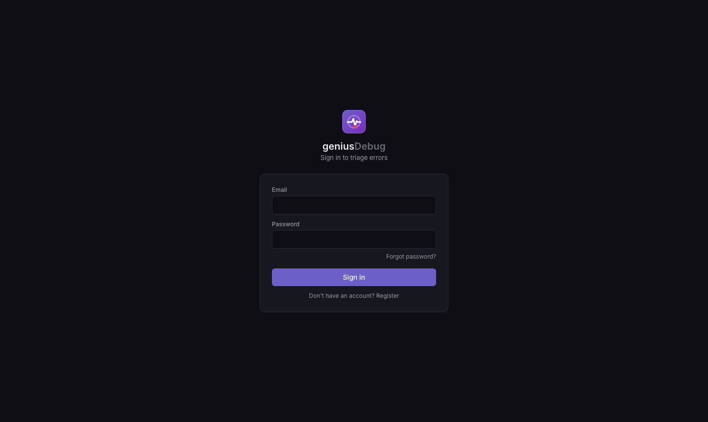

<div align="center">

# geniusDebug

**A minimal, self-hosted Sentry alternative for frontend error monitoring.**

Capture, group, and triage runtime errors from a Next.js app — stack traces, source-mapped
code locations, distributed traces, and short session replays — without Sentry's cost or overkill.

</div>

---

## What it is

geniusDebug **reuses the open-source `@sentry/nextjs` SDK** pointed at its own backend; the
backend speaks the **Sentry envelope protocol**. No browser SDK is built. It implements only the
slice of Sentry a small team actually uses day-to-day, self-hosted on your own infra.

- **Cost** — no per-event / replay / seat pricing.
- **Fit** — own the slice you use; no vendor lock-in.
- **Isolation** — runs on separate infra; if geniusDebug is slow or down, the monitored app is unaffected.

## Screenshots

### Issues feed — grouped, triageable


### Issue detail — symbolicated stack, highlights, trace/replay, activity


### Trace waterfall


### Session replay (on-error, privacy-masked)


### Alerts — rules with dedupe/throttle & frequency triggers


### Settings — DSN, kill switch, GitHub App, members, retention, metrics


### First-time login / register


## Architecture (four parts)

```
  Taskip app + @sentry/nextjs ──envelope(tunnel)──▶ Ingest (NestJS)  ──enqueue──▶ Redis (BullMQ)
                                                    fast 202, no heavy work                │
                                                                                           ▼
   React SPA ◀──REST──▶ API (NestJS) ◀──read── PostgreSQL ◀──persist── Workers (NestJS pipeline)
   (dashboard)                                  (metadata)   normalize→symbolicate→group→persist→alert
                                                    ▲                              │
                                              Cloudflare R2 (blobs) ◀── replay/maps │ SES (email alerts)
```

| Part | Package | Role |
|---|---|---|
| **Ingest** | `apps/ingest` | Sentry envelope endpoint — auth, rate-limit, size caps, enqueue. p95 < 25ms, no heavy work. |
| **Workers** | `apps/workers` | Queue consumers — normalize → symbolicate → fingerprint → group → persist → alert. Idempotent, DLQ. |
| **API** | `apps/api` | Auth (login/register), issues, actions, projects, traces, replays, alerts, GitHub App, metrics. |
| **Web** | `apps/web` | React + Vite + Tailwind + Zustand + TanStack Query dashboard. |
| **DB** | `packages/db` | Drizzle schema + migrations; `events` is time-partitioned. |
| **Shared** | `packages/shared` | Sentry envelope + domain types, zod schemas (platform-agnostic). |

## Features

- **Error grouping** into deduplicated Issues with fingerprinting, short IDs, regression detection.
- **Symbolication** — Debug-ID → source maps in R2, original file/line/function + source context.
- **GitHub** — App manifest flow (personal or org), per-frame "Open in GitHub", suspect commits, auto-resolve on `fixes SHORT-ID`.
- **Distributed traces** — span waterfall with error markers, links back to issues.
- **Session replay** — on-error, privacy-masked, timeline with error markers.
- **Alerts** — new / regression / frequency (spike) rules, dedupe + throttle + snooze, AWS SES.
- **Triage UX** — filters, sort, global search (⌘K), keyboard nav (j/k/e/x/↵), merge, assign, editable highlights.
- **Admin** — projects, DSN keys (regenerate/revoke), members (roles), retention windows, usage stats.
- **Safety** — remote kill switch (disable ingest without a redeploy), back-pressure shedding, dead-letter queue.
- **Scale** — time-partitioned events with auto-rolled monthly partitions + retention purge.

## Tech stack

NestJS · PostgreSQL (Drizzle ORM) · Redis (BullMQ) · Cloudflare R2 · AWS SES · React + Zustand + Tailwind · `@sentry/nextjs`.

## Quick start (local, npm workspaces)

Prereqs: Node ≥ 20, PostgreSQL, Redis.

```bash
npm install
createdb geniusdebug_dev
cp .env.example .env                         # never commit .env
npm run build -w @geniusdebug/shared         # build shared + db so apps resolve them
npm run build -w @geniusdebug/db
npm run migrate -w @geniusdebug/db           # schema + partitioned events

npm run dev                                  # api :4002 · ingest :4001 · workers · web :5173

# open the web app → first run shows "Create your account" (you become admin);
# registering provisions a default project + DSN + environments + a default alert rule.

npm run seed -w @geniusdebug/db              # fire the reference incident through ingest → worker
npm test                                     # 19 automated tests (ingest + workers)
```

## Monorepo layout

```
apps/{ingest,workers,api,web}     services
packages/{db,shared}              schema/migrations + shared types
scripts/upload-sourcemaps.mjs     deploy-time Debug-ID → R2 uploader
taskip-integration/               drop-in @sentry/nextjs reference wiring
docs/                             SRS, design brief, screenshots
```

## Docs

- **[DEPLOY.md](DEPLOY.md)** — deploy on Coolify or a plain VPS.
- **[INTEGRATION.md](INTEGRATION.md)** — point an existing app (already using Sentry packages) at geniusDebug.
- **[docs/geniusDebug-SRS.md](docs/geniusDebug-SRS.md)** — full requirements spec (v1.5).
- **[docs/frontend-design-brief.md](docs/frontend-design-brief.md)** — design system + every page.
- **[CLAUDE.md](CLAUDE.md)** — project guide, golden rules, sprint tracker.

## Status

v1 = Next.js frontend monitoring, feature-complete. **Laravel/PHP is planned for v2** (SRS §12) — the
pipeline is already platform-agnostic and skips symbolication for non-JS, so v2 is client-config only.

## License

Internal — Xgenious. Reuses `@sentry/nextjs` (MIT).
