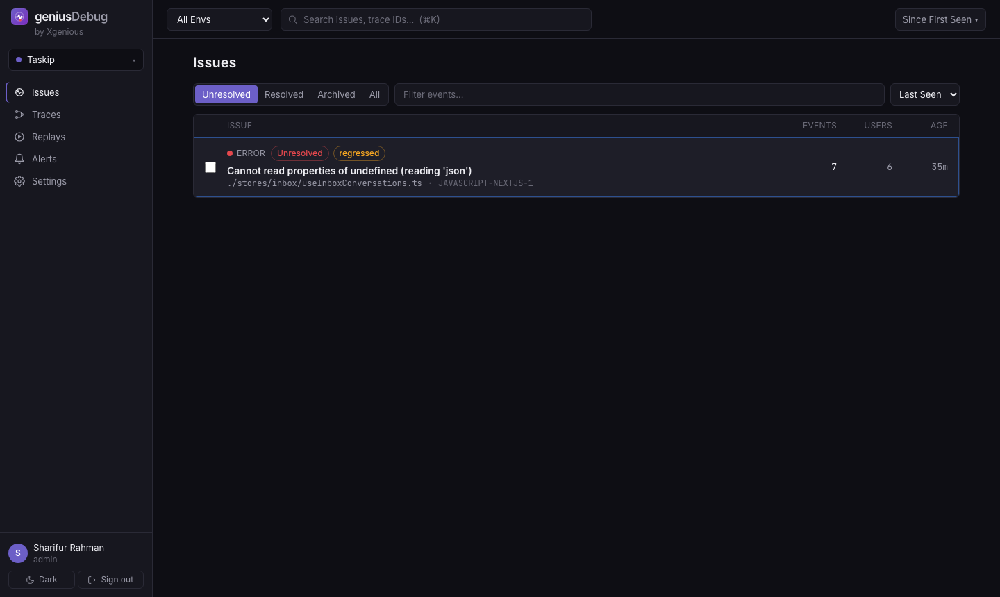
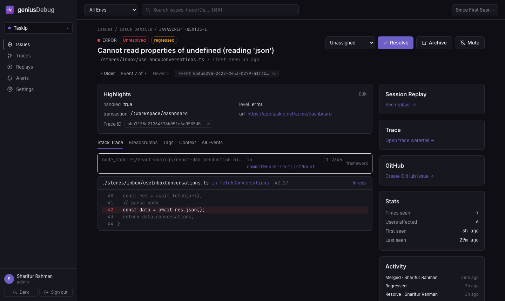
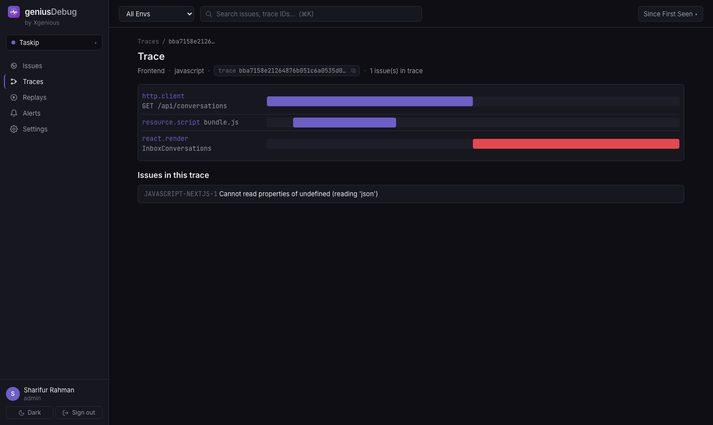
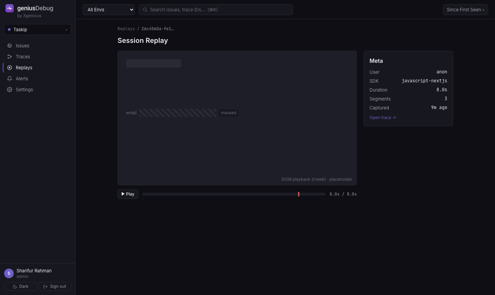
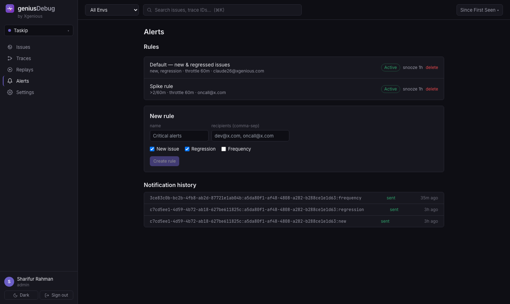
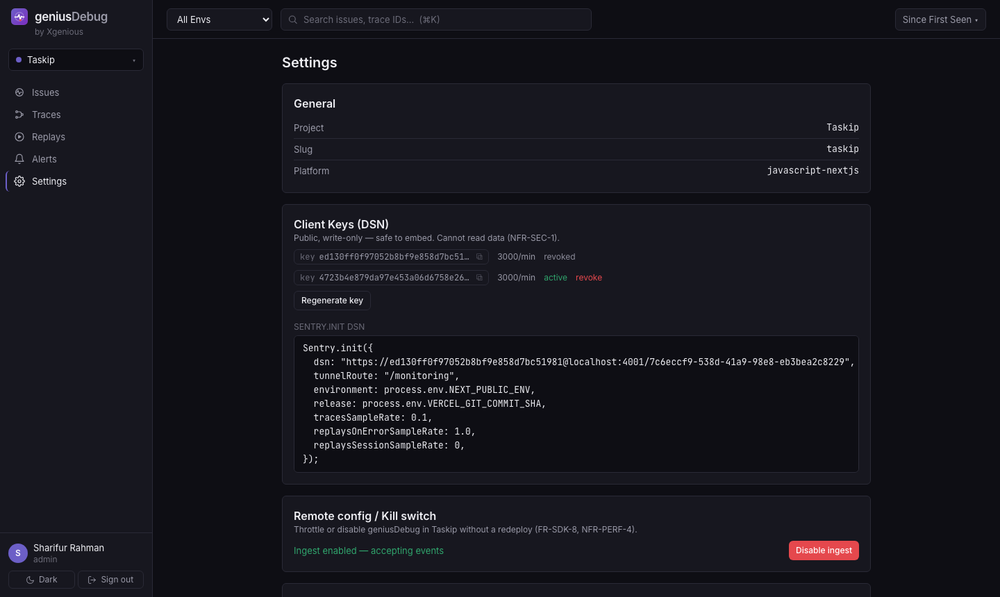

# geniusDebug

**A minimal, self-hosted Sentry alternative for frontend error monitoring.**

Capture, group, and triage runtime errors from a Next.js app — stack traces, source-mapped code
locations, distributed traces, and short session replays — without Sentry's cost or overkill.

geniusDebug **reuses the open-source `@sentry/nextjs` SDK** pointed at its own backend; the backend
speaks the **Sentry envelope protocol**. No browser SDK is built. It implements only the slice of
Sentry a small team actually uses day-to-day, self-hosted on your own infra.

- **Cost** — no per-event / replay / seat pricing.
- **Fit** — own the slice you use; no vendor lock-in.
- **Isolation** — runs on separate infra; if geniusDebug is slow or down, the monitored app is unaffected.

- :material-rocket-launch: **[End-to-end deployment guide](deployment-guide.md)** — VPS → Coolify / AWS / DigitalOcean → project + SDK → post-deploy. Start here.
- :material-docker: **[Self-host with Docker](self-hosting-docker.md)** — one `docker compose up`, whole stack.
- :material-server: **[Deploy without Docker](deploy.md)** — Coolify (Nixpacks) or a plain VPS (pm2).
- :material-cog: **[Configuration](configuration.md)** — every environment variable, explained.
- :material-connection: **[Integrate an app](integration.md)** — point an existing Sentry app at geniusDebug.

---

## Screenshots

### Issues feed — grouped, triageable

### Issue detail — symbolicated stack, highlights, trace/replay, activity

### Trace waterfall

### Session replay (on-error, privacy-masked)

### Alerts — rules with dedupe/throttle & frequency triggers

### Settings — DSN, kill switch, GitHub App, members, retention, metrics

---

## Features

- **Error grouping** into deduplicated Issues with fingerprinting, short IDs, regression detection.
- **Symbolication** — Debug-ID → source maps in R2, original file/line/function + source context.
- **GitHub** — App manifest flow (personal or org), per-frame "Open in GitHub", suspect commits, auto-resolve on `fixes SHORT-ID`.
- **Distributed traces** — span waterfall with error markers, links back to issues.
- **Session replay** — on-error, privacy-masked, timeline with error markers.
- **Alerts** — new / regression / frequency (spike) rules, dedupe + throttle + snooze, AWS SES.
- **Triage UX** — filters, sort, global search (⌘K), keyboard nav (j/k/e/x/↵), merge, assign, editable highlights.
- **Admin** — projects, DSN keys (regenerate/revoke), members (roles), retention windows, usage stats.
- **Safety** — remote kill switch (disable ingest without a redeploy), back-pressure shedding, dead-letter queue.
- **Scale** — time-partitioned events with auto-rolled monthly partitions + retention purge.

## Tech stack

NestJS · PostgreSQL (Drizzle ORM) · Redis (BullMQ) · Cloudflare R2 · AWS SES · React + Zustand +
Tailwind · `@sentry/nextjs`.

## Status

v1 = Next.js frontend monitoring, feature-complete. **Laravel/PHP is planned for v2** (SRS §12) — the
pipeline is already platform-agnostic and skips symbolication for non-JS, so v2 is client-config only.
